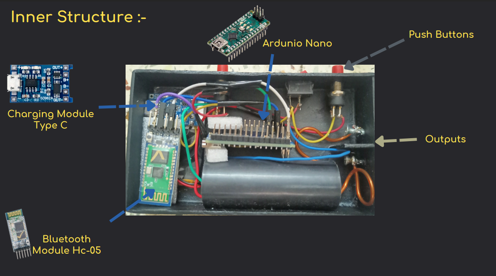
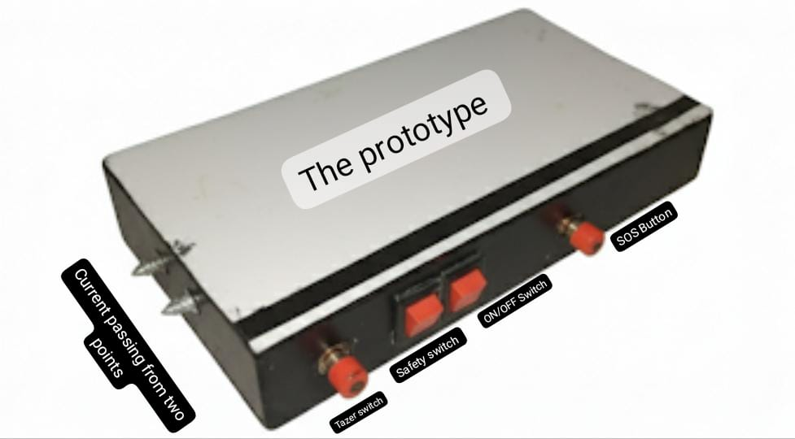

# ⚡ Smart SOS Stun Gun

This stun gun is designed for personal safety and self-defence in violent situations.
It is connected to a mobile app for easy control and monitoring.
With an integrated SOS system, it instantly sends safety alerts and location details to emergency contacts.

---

## 🔹 Features
- **Use in violent situations** with high-voltage current.  
- **Smart SOS functionality** – sends alerts to emergency contacts.  
- **Arduino Nano** as the main operator.  
- **HC-05 Bluetooth module** for phone connectivity.  
- **Mobile App** built with Android Studio for SMS/email alerts.  
- **Quick response time** – SOS alert delivered in ~3 seconds.  
- **Safety assured** – built-in fuse, anti-slip grip, legal compliance.  

---

## 🔹 System Flow
1. User presses **SOS button**.  
2. Arduino Nano sends signal to **HC-05 module**.  
3. Bluetooth transmits SOS to **mobile app**.  
4. App triggers **SMS/Email alert** to emergency contacts.  

---

## 🔹 Hardware Components
- Arduino Nano  
- HC-05 Bluetooth Module  
- Booster Module
- Rechargeable Battery + Charging Module  
- Switches for stun gun activation and SOS  

---

## 🔹 Future Enhancements
- GPS integration for live location sharing.  
- Multiple emergency contacts.  
- Voice recording for emergency context.  
- Remote control options.  

---

## 🔹 Performance
- ✅ **99.9% success rate** in tests  
- ⚡ **~3 seconds** average alert delivery time  

---

## 📸 Prototype

---

## 👨‍💻 Lead
- Govindraj Hippargi  

---
## 🏆 Awards
- WITCHAR 2025 at WIT Solapur

---

## Note
- I have uploaded the android studio app code zip and the demo app
